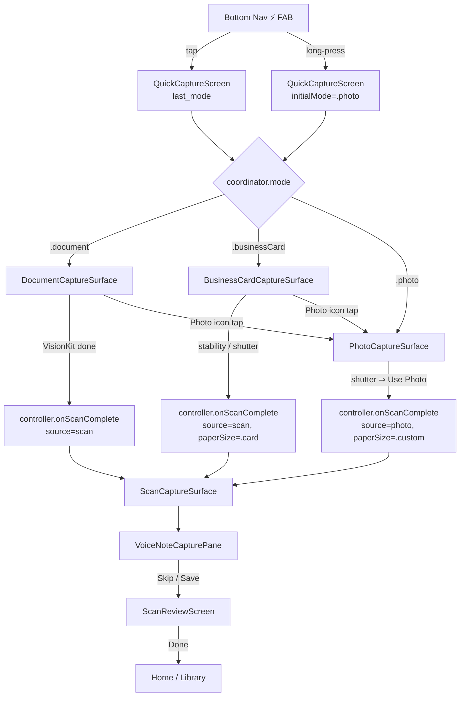

# Photo Capture — Prototype Spec

A third capture surface for QuickInk that lets a user snap a single
photo and have it land in the existing scan flow at the voice-note
step (then review). Two entry points: long-press on the bottom-nav
⚡ FAB, and an in-screen Photo icon on `QuickCaptureScreen`.

## 1. Goals & non-goals

**Goals**

- Add a discoverable way to capture a one-shot photo into the same
  pipeline that backs Document and Business Card scans.
- Land on the existing `VoiceNoteCapturePane` → `ScanReviewScreen`
  sequence after the shutter, with no new tagging/review surface.
- Reuse `ScanFlowController.onScanComplete`, `ImportArtifacts`, and
  `ScanCaptureSurface` so persistence, OCR, voice-note attach, and
  analytics-outbox enqueue keep working unchanged.
- Two entry points: long-press the ⚡ FAB (fast path, skips the
  pill), and a Photo icon on the existing capture-screen chrome
  (discoverable).

**Non-goals**

- Multi-shot photo bursts. Photo mode is single-frame; users who
  want multi-page imports already have the gallery `PhotosPicker`
  on `DocumentCaptureSurface`.
- Document-style quad detection / auto-capture. Photo mode is a
  plain shutter — no `BusinessCardDetector` or `StabilityGate`.
- A new review screen. The existing review surface already handles
  any `source` value; we just add `"photo"`.

## 2. Where it plugs in (current architecture)

```
┌──────────────────────────┐
│  QuickInkBottomNavBar    │  ⚡ FAB (zapFab)
│  .zapFab → onScan()      │     tap   → existing route
└──────────┬───────────────┘     long  → NEW route
           │
           ▼
┌──────────────────────────┐
│  QuickInkRoot            │  showQuickCapture = true
│  .fullScreenCover        │  (no initialMode today)
└──────────┬───────────────┘
           │
           ▼
┌──────────────────────────┐
│  QuickCaptureScreen      │  Mode pill: Document | Business Card
│  CaptureModeCoordinator  │  (NEW third mode .photo, but pill
│  switch coordinator.mode │   stays two-wide — see §3.1)
└──────────┬───────────────┘
   │       │       │
   ▼       ▼       ▼
Document  Card   PHOTO          ← new surface, §4
  ↓       ↓       ↓
 controller.onScanComplete(pdfURL, previewURL, pageURLs,
                           source, paperSize)
           │
           ▼
┌──────────────────────────┐
│  ScanCaptureSurface      │  Phase 1: VoiceNoteCapturePane
│  (mounted when state     │  Phase 2: ScanReviewScreen
│   leaves .idle)          │
└──────────────────────────┘
```

`ScanFlowController.onScanComplete` already takes a `source: String`
and a `paperSize: PaperSize`. The default-folder write, OCR pipeline,
title auto-pick, location capture, and `onPassComplete` analytics
fanout all run downstream of that call — every one of them is
source-agnostic, so Photo mode inherits them for free.

## 3. Entry points

### 3.1 Long-press on the ⚡ FAB

The FAB lives in `QuickInkBottomNavBar.zapFab`. Today it's:

```swift
Button(action: onScan) { … }
```

**Change:** wrap the inner ZStack in a gesture stack so tap and
long-press both work, and add an `onLongPressScan` callback alongside
`onScan`:

```swift
public let onScan: () -> Void          // unchanged — Document
public let onLongPressScan: () -> Void // NEW — Photo

…

private var zapFab: some View {
    ZStack { … }                       // same visual
        .offset(y: -16)
        .onTapGesture          { onScan() }
        .onLongPressGesture(minimumDuration: 0.4) {
            UIImpactFeedbackGenerator(style: .medium).impactOccurred()
            onLongPressScan()
        }
        .accessibilityLabel("Quick capture")
        .accessibilityHint("Double tap to scan, long press for photo")
}
```

`QuickInkRoot` wires `onLongPressScan` to the same `showQuickCapture`
fullscreen cover but passes an `initialMode: .photo` override:

```swift
.fullScreenCover(isPresented: $showQuickCapture) {
    QuickCaptureScreen(
        controller:  controller,
        initialMode: pendingInitialMode,  // .photo or nil
        onDismiss:   { showQuickCapture = false; pendingInitialMode = nil }
    )
}
```

`QuickCaptureScreen.init` keeps its existing UserDefaults-driven
default but takes a precedence override:

```swift
init(controller: ScanFlowController,
     initialMode: CaptureMode? = nil,
     onDismiss: @escaping () -> Void) {
    let starting = initialMode ?? CaptureMode.fromAnalyticsKey(
        UserDefaults.standard.string(forKey: "quickink.capture.last_mode")
    )
    _coordinator = StateObject(wrappedValue: CaptureModeCoordinator(initial: starting, …))
}
```

**Important:** the long-press path must NOT persist `.photo` into
`quickink.capture.last_mode`. The next tap on the FAB should still
land on the last *pill-selected* mode (Document or Business Card),
not whichever surface a long-press transiently brought up. Pass a
`persist: { _ in }` no-op coordinator for the long-press route, or
gate the existing persist hook with `if mode != .photo`.

**Discoverability:** first-launch tooltip on the FAB after the user
has scanned at least once — "Hold ⚡ for a quick photo." Hide
permanently after first long-press fires.

### 3.2 In-screen Photo icon

`DocumentCaptureSurface.shutterRow` already has a 64×64 left-side
slot reserved with `Spacer().frame(width: 64)` (so the centre
shutter stays centred against the right-side Import button). Put
the Photo icon there:

```
[ Photo ]      [ ⚡ Shutter ]      [ Import ]
   64               main                64
```

Visual: 48×48 disc, `Color.white.opacity(0.10)` background, SF
Symbol `camera`, `Color.white.opacity(0.85)` foreground. Same
treatment as the existing `importButton`.

```swift
@ViewBuilder
private var photoModeButton: some View {
    Button(action: { coordinator.select(.photo) }) {
        Image(systemName: "camera")
            .font(.system(size: 22, weight: .medium))
            .foregroundStyle(Color.white.opacity(0.85))
            .frame(width: 48, height: 48)
            .background(Color.white.opacity(0.10))
            .clipShape(Circle())
    }
    .accessibilityLabel("Take a photo")
}
```

Replace the left `Spacer().frame(width: 64)` with `photoModeButton
.frame(width: 64, height: 64)`.

`BusinessCardCaptureSurface` gets the same treatment — its shutter
row should expose the same Photo entry so it's discoverable
regardless of which scanning mode the user happens to be in.

### 3.3 Mode pill: leave at two

The user-picked answer was "long-press FAB + Photo icon", so the
top-bar pill stays two-wide (Document / Business Card). Reasons to
keep it two-wide:

- Three pills on the small top bar starts to crowd; the pill is
  centred today with 36pt close + 36pt right-slot spacer, leaving
  ~280pt on a 393pt-wide device.
- The Photo icon in the shutter row is contextual and easier to
  reach with one hand — it sits where the import button already
  is.
- Long-press FAB is the canonical "I just want a photo, fast"
  shortcut.

If the pill ever grows to three, also update the `pillLabel`
ordering: `Document, Photo, Business Card` (Photo in the middle
matches Instagram's PHOTO-VIDEO-STORY ordering and reduces the
chance of accidental Business-Card taps).

## 4. PhotoCaptureSurface (new)

A new file: `ios/QuickInk/Scan/PhotoCaptureSurface.swift`. Sibling
to `DocumentCaptureSurface` and `BusinessCardCaptureSurface`.

### 4.1 States

```
.permissionGate    ─ AVAuthorizationStatus pre-flight
       │
       ▼
.preview           ─ live AVCaptureSession with shutter + flash + flip
       │ shutter tap
       ▼
.captured(image)   ─ frozen still + Retake / Use Photo buttons
       │ Use Photo
       ▼
   exit → controller.onScanComplete(source: "photo", paperSize: .custom)
```

### 4.2 Permission gate

Reuse the `PermissionRationale` helper that
`BusinessCardCaptureSurface` already uses. Copy:

> **Allow camera to take photos**
> Photo mode uses your camera to capture a still image. You can
> still scan documents and import from your library without it.

`AVAuthorizationStatus.denied`/`.restricted` falls back to a "Open
Settings" CTA, same as the card surface.

### 4.3 Preview chrome

```
┌──────────────────────────────────────┐
│  ⚡ flash      4:3      ⤺ flip      │  top icon row
│                                       │
│      [ live AVCaptureSession ]        │
│                                       │
│                                       │
│                                       │
│         ⓘ Tap to focus                │  fades after 3s
│                                       │
│                                       │
│      ┌──────┐                         │
│      │ ▢▢▢ │  ●●●  shutter (78pt)    │  bottom shutter row
│      └──────┘                         │
│       last         Photo / Document   │  small mode crumb
│       photo                           │
└──────────────────────────────────────┘
```

- Shutter: same 78pt coral disc + white ring as
  `documentShutterButton`. Inner SF Symbol changes to `camera.fill`.
- Flash toggle: 3-state (auto / on / off), top-left, persisted via
  `UserDefaults` key `quickink.capture.photo.flash`.
- Flip toggle: top-right, front/back camera switch.
- Tap-to-focus: standard AVCapture `focusPointOfInterest`.
- Bottom-left "last photo" thumbnail is optional — if rendered, it
  opens `PhotosPicker`; if cut, it leaves room for a future Photo
  Library shortcut.
- The top-bar mode pill from `QuickCaptureScreen` keeps painting
  above; coordinator-switching back to Document/Business Card
  tears down this surface via SwiftUI's normal unmount.

### 4.4 Captured preview

After the shutter fires:

```
┌──────────────────────────────────────┐
│  ✕ Retake                            │
│                                       │
│      [   captured still   ]          │
│                                       │
│                                       │
│                                       │
│             ✓ Use Photo               │   coral CTA
└──────────────────────────────────────┘
```

- "Retake" returns to `.preview` and discards the buffer.
- "Use Photo" runs `ImportArtifacts.build(from: [image])` (same
  helper the PhotosPicker import path uses), then calls:

```swift
controller.onScanComplete(
    pdfURL:     result.pdfURL,
    previewURL: result.previewURL,
    pageURLs:   result.pageURLs,
    source:     "photo",
    paperSize:  .custom        // photos aren't paper — see §6
)
onDismiss()                    // closes QuickCaptureScreen
```

The `onDismiss()` collapses the capture cover; `QuickInkRoot` is
already observing the controller and will mount
`ScanCaptureSurface` (voice note → review) on the next render.

### 4.5 Camera session lifecycle

- `AVCaptureSession` is `@StateObject`-owned, started on
  `.onAppear` of the active surface, stopped on `.onDisappear`.
- Photo output: `AVCapturePhotoOutput` with
  `AVCapturePhotoSettings(format: [AVVideoCodecKey: AVVideoCodecType.jpeg])`,
  `isHighResolutionPhotoEnabled = true`.
- No video data delegate (no per-frame detection needed).
- Threading: capture-photo delegate fires on a session queue;
  marshal the resulting `Data → UIImage` back to MainActor before
  swapping the surface state.

## 5. CaptureMode + analytics extensions

`CaptureMode.swift`:

```swift
public enum CaptureMode: String, CaseIterable, Sendable {
    case document
    case businessCard
    case photo            // NEW

    public var analyticsKey: String {
        switch self {
        case .document:     return "document"
        case .businessCard: return "business_card"
        case .photo:        return "photo"
        }
    }

    public var pillLabel: String {
        switch self {
        case .document:     return "Document"
        case .businessCard: return "Business Card"
        case .photo:        return "Photo"
        }
    }

    public var paperSize: PaperSize {
        switch self {
        case .document:     return .a4
        case .businessCard: return .card
        case .photo:        return .custom
        }
    }

    public static func fromAnalyticsKey(_ key: String?) -> CaptureMode {
        switch key {
        case "business_card": return .businessCard
        case "photo":         return .photo
        default:              return .document
        }
    }
}
```

`QuickCaptureScreen` dispatch adds a `.photo` branch:

```swift
switch coordinator.mode {
case .document:     DocumentCaptureSurface(…)
case .businessCard: BusinessCardCaptureSurface(…)
case .photo:        PhotoCaptureSurface(controller: controller, onDismiss: onDismiss)
}
```

`CaptureAnalytics` already takes any `CaptureMode`, so
`modeSelected(.photo)` / `manualFired(mode: .photo)` work with no
type changes. Existing dashboards will see a new `mode=photo`
value flow into `capture_mode_selected` and `capture_manual_fired`.

## 6. Persistence — `source` and `paperSize`

The capture row already has columns for both. Photo mode passes:

- `source: "photo"` — distinct from `"scan"` (Document) and
  `"import"` (PhotosPicker). The Library card renderer can paint
  a "Photo" pill from this value. Until the Library is updated to
  recognise the new value, photos fall back to the existing "no
  pill" rendering — no migration required.
- `paperSize: .custom` — photos aren't paper, and the
  sustainability hero treats `.custom` as the same +0.2 pts/page
  weight as A4. We deliberately *don't* run
  `classifyPaperSize(width:height:)` here: the rectified aspect
  ratio of an arbitrary phone-camera frame is meaningless against
  the A4 / Letter / card ratio bands.

`ScanReviewScreen` already has the paper-size chip strip the user
can override to `.a4`/`.a5`/`.letter`/`.card`/`.custom`, so if a
user did photograph a sheet of paper they can re-bucket it during
review.

## 7. Voice-note pre-review behaviour

Nothing changes here. `ScanCaptureSurface` mounts
`VoiceNoteCapturePane` whenever `ScanFlowController.state` leaves
`.idle`, regardless of source:

```swift
if !voiceNoteCompleted, let captureId = captureId {
    VoiceNoteCapturePane(…)
} else {
    ScanReviewScreen(…)
}
```

So after the photo capture's `controller.onScanComplete` lands,
the user gets exactly what the prompt asked for: "return back and
continue with the current flow of scanning document but from voice
notes capture."

One copy nit: `VoiceNoteCapturePane` doesn't currently mention the
source. It just says "Add a voice note for this scan." That copy
holds up for photos too, so no string changes.

## 8. OCR pipeline

`OcrPipeline.recognizePages(pageURLs)` is happy to run Vision text
recognition on any JPEG. Photos that happen to contain text (a
receipt snap, a chalkboard, a passport page) will get OCR'd and
the leading-token auto-tag matcher will fire as usual. Photos with
no text just produce a `.failure` per page and the capture row's
`hasOcr` ends up `false` — same code path that already exists for
"scanned blurry sheet" cases.

The auto-title fallback in `ScanFlowController.computeInitialTitle`
prefers the picked category, then the first two words of OCR.
Photos with no OCR will land with a null title; the Library card's
title-cascade already handles that.

## 9. Permissions, Info.plist, ATS

`NSCameraUsageDescription` already exists for VisionKit and
business-card mode — no Info.plist change. We do not need
`NSPhotoLibraryUsageDescription` for the camera-only path; the
existing PhotosPicker path on `DocumentCaptureSurface` already has
that key.

If we add the bottom-left "last photo" thumbnail from §4.3, the
existing PhotosPicker entitlement covers it.

## 10. Telemetry

Events fired through the existing capture flow, all source-tagged
or mode-tagged:

| Event                    | Source       | Notes                              |
| ------------------------ | ------------ | ---------------------------------- |
| `capture_mode_selected`  | coordinator  | `mode=photo` on entry              |
| `capture_manual_fired`   | shutter tap  | `mode=photo`                       |
| `capture_event` (outbox) | `onPassComplete` | `source=photo` ends up on row  |

No new event types. No backend change required.

## 11. Edge cases

- **Long-press while a scan is mid-flight.** The controller's
  `state` is non-`.idle`, so `ScanCaptureSurface` is already
  mounted. Surface that case with a snackbar "Finish your current
  scan first" on the FAB long-press, and don't present
  `QuickCaptureScreen`. (Tap-FAB already has this problem
  silently — opening QuickCaptureScreen mid-flight is a latent
  bug; out of scope here, file a follow-up.)
- **Camera permission denied at long-press entry.** The
  PhotoCaptureSurface's permission gate handles it the same way
  the card surface does. Long-press into a denied state still
  shows the rationale; the user can switch to Document mode via
  the pill without re-granting.
- **App backgrounded during `.captured(image)` state.** Drop the
  buffer on `.onDisappear`; on re-entry land on `.preview`. The
  buffer is volatile by design — preserving it across a
  background round-trip is more state than the feature warrants.
- **Storage failure inside `ImportArtifacts.build`.** Returns
  `nil`; the surface stays on `.captured` and shows an inline
  "Couldn't save photo — try again" toast above the Use Photo
  CTA. Same fallback the import path uses.

## 12. Flow diagram (Mermaid)



## 13. Files touched

**New**

- `ios/QuickInk/Scan/PhotoCaptureSurface.swift` — the surface, the
  permission gate, the AVCaptureSession wrapper, the captured-
  state preview UI.

**Modified**

- `ios/QuickInk/Scan/CaptureMode.swift` — add `.photo` case +
  analytics key + pill label + paper-size map.
- `ios/QuickInk/Scan/QuickCaptureScreen.swift` — `.photo` branch
  in surface dispatch; accept `initialMode: CaptureMode?` in init
  with a no-persist override path for long-press entry.
- `ios/QuickInk/Scan/DocumentCaptureSurface.swift` — replace the
  left 64pt spacer in `shutterRow` with the Photo icon button.
- `ios/QuickInk/Scan/CardCapture/BusinessCardCaptureSurface.swift`
  — same Photo icon button in its shutter row.
- `ios/QuickInk/Nav/QuickInkBottomNavBar.swift` — add
  `onLongPressScan` callback; attach `.onLongPressGesture` to the
  zap FAB.
- `ios/QuickInk/App/QuickInkRoot.swift` — wire
  `onLongPressScan` to set `pendingInitialMode = .photo` + flip
  `showQuickCapture`, and reset both on dismiss.

**Read-only**

- `ios/QuickInk/Scan/ScanFlowController.swift` — no change; the
  existing `source` and `paperSize` parameters carry the new
  values.
- `ios/QuickInk/Scan/ImportArtifacts.swift` — reused for
  single-image PDF + preview encoding.
- `ios/QuickInk/Scan/ScanCaptureSurface.swift` — no change;
  voice-note → review sequencing is source-agnostic.
- `ios/QuickInk/Scan/VoiceNoteCapturePane.swift` — no change.
- `ios/QuickInk/Scan/CaptureAnalytics.swift` — no change;
  parameterised on `CaptureMode`.
- `ios/QuickInk/Scan/CaptureModeCoordinator.swift` — no change;
  but callers using the long-press path pass `persist: { _ in }`.

## 14. Android parity

Every iOS file touched here has a Kotlin mirror (`CaptureMode.kt`,
`QuickCaptureScreen.kt`, `DocumentCaptureSurface.kt`,
`BusinessCardCaptureSurface.kt`, `QuickInkBottomNavBar.kt`,
`CaptureAnalytics.kt`). The Android port should land the same
`.photo` enum case, the same long-press handler on the FAB
(`Modifier.combinedClickable`), and the same source/paperSize
forwarding into the Kotlin `ScanFlowController.onScanComplete`.
File the mirror change as a paired ticket — the existing
"mirror of …" headers in each file's docblock are the parity
contract.

## 15. Open questions

1. Should "last photo" thumbnail in §4.3 ship in v1 or wait? (My
   pick: ship empty 64pt slot, add thumbnail in v1.1 once we
   confirm camera-roll permission expectations.)
2. Should the Photo icon in §3.2 also live on the Home screen
   (next to the FAB), or only inside `QuickCaptureScreen`? (My
   pick: only inside the capture screen — keeping Home
   uncluttered, and the long-press FAB already covers the
   Home-level shortcut.)
3. Library card rendering for `source=photo` — distinct pill or
   reuse "Scan"? (My pick: distinct "Photo" pill; small follow-up
   to `WorkspaceDocThumbnail`/`CaptureRowView`.)
