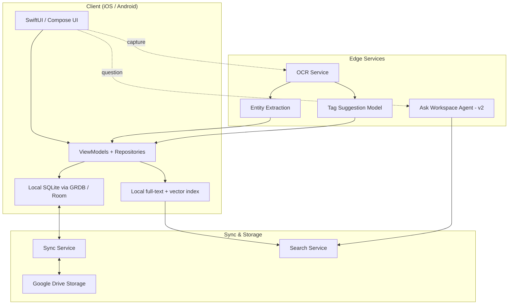
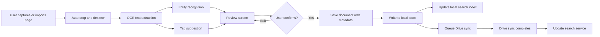
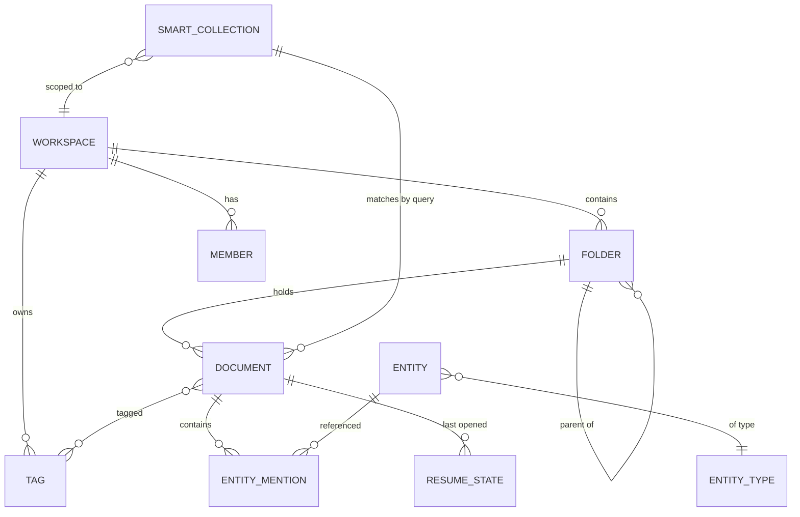
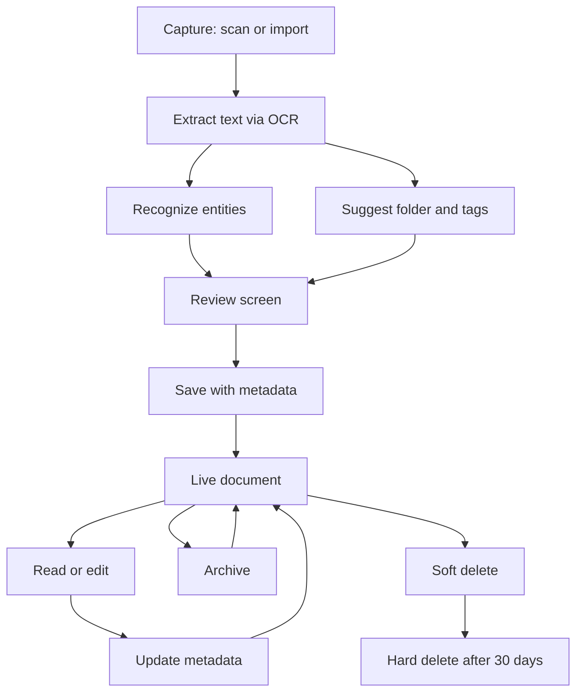
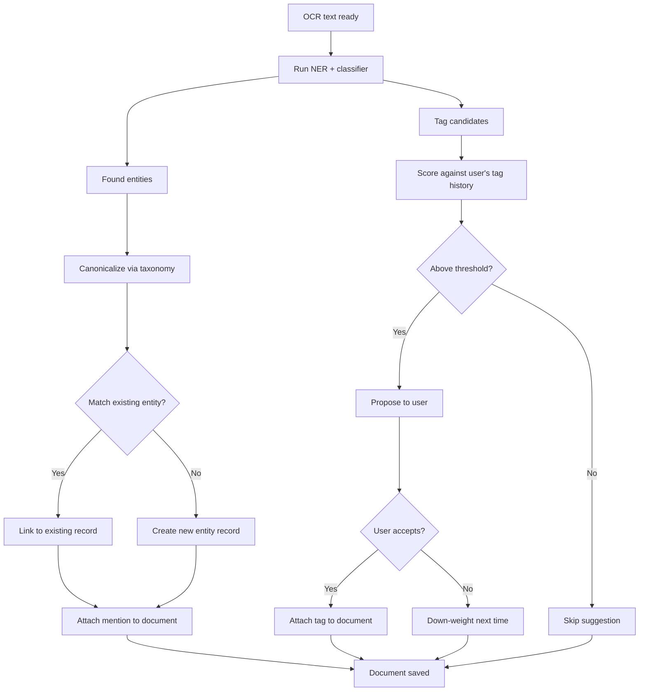

# QuickInk Workspace — Product Specification

**Status:** Draft v1
**Owner:** Product
**Audience:** Design, Product, Engineering
**Last updated:** May 12, 2026

---

## 1. Executive Summary

QuickInk Workspace is an AI-native document workspace for anyone who captures, reads, and revisits paper-based information — invoices, meeting notes, contracts, business cards, receipts, handwritten ideas. It replaces the current Library experience with a richer model: documents live in a primary folder, carry many tags, and connect to structured entities (people, organizations, dates, amounts) extracted automatically from their content.

Users land in their workspace and immediately see where they were last working, the tags they use most, and the folders that hold their active projects. Search threads through everything — text, tags, entities, folders — so the question *"what invoices did Vercel send in Q1?"* can be answered in one step.

The product ships in three layers: **folders for stable organization**, **tags for flexible retrieval**, and **entities for structured intelligence**. **Smart Collections** combine all three into saved, dynamic views. An AI assistant — **Ask Workspace** — answers questions across the entire knowledge base.

This document defines the information architecture, naming conventions, user flows, and rollout plan. It is the source of truth for the teams shipping v1 and planning the v2/v3 surface.

---

## 2. Product Vision

> **Build the calmest, smartest place to keep documents.**

Today's scanner apps treat every page as a transaction — scan, save, forget. Knowledge tools (Notion, Mem, Craft) treat documents as second-class citizens, optimized for text but not for paper. We sit between the two: a scanner-grade capture experience attached to a knowledge-graph backbone, with AI doing the metadata work so the user doesn't have to.

In twelve months, QuickInk Workspace is the default app a user opens when they need to find any document they have ever scanned — not because they remember where it was filed, but because they can describe what was on it.

---

## 3. Problem Statement

Users today fail at three jobs the existing app does not solve.

**Re-finding.** A user scans a contract today and needs it back in eighteen months. Folders alone do not survive that gap — the user has forgotten the folder name. Search needs to work on what the document *says*, not where it was filed.

**Cross-cutting retrieval.** A user wants "all invoices from Vercel" or "all docs mentioning Alice." A folder hierarchy can only express one dimension at a time. Tags and entities are needed to slice the same document multiple ways.

**Continuity.** A user opens a doc, reviews three pages, and gets interrupted. The next time they come back, they restart from scratch. The app should remember.

These three failures collapse into one symptom: documents go in, but the user does not trust they can get them back. QuickInk Workspace fixes the trust deficit.

---

## 4. Core Principles

Six principles guide every product and design decision.

| # | Principle | What it means in practice |
|---|-----------|----------------------------|
| 1 | Capture is sacred | The scan flow stays one tap. Workspace organization happens after capture, not during. |
| 2 | Folders for stability, tags for flexibility | A document has exactly one home folder and as many tags as needed. The two layers never collapse into one. |
| 3 | AI does metadata; humans confirm | OCR, entity extraction, and tag suggestions run automatically. The user reviews, never authors from scratch. |
| 4 | Search-first navigation | The top of every workspace screen is search. Folder-walking is a fallback, not the default. |
| 5 | Local-first, sync later | Reads and writes are instant against a local store. The cloud is a sync target, not a dependency. |
| 6 | Convention over configuration | Naming rules, default tag taxonomy, and entity types are pre-defined. Users can extend, but never start from a blank slate. |

---

## 5. Information Architecture

The IA has five layers. Each has a distinct job. Mixing them is the most common product mistake; we keep them separate by design.

### 5.1 Workspaces

A workspace is a top-level container — a self-contained vault scoped to a person or team. Personal workspaces (single user) and shared workspaces (multi-user) follow the same model.

A workspace owns its own folders, tags, entities, members, and permissions. Cross-workspace search is supported in v2; v1 ships single-workspace.

> **Plain English:** A workspace is the whole filing cabinet. Folders are the drawers inside. Tags are the colored sticky notes you can attach to any document in any drawer.

### 5.2 Folders

Folders are stable containers. They answer the question *where does this document live?* Each document belongs to exactly **one** folder. Folders form a shallow hierarchy (max depth 3) and represent durable categories — Invoices, Contracts, Travel, Meeting Notes.

Folders carry: name, color, optional cover monogram, parent folder ID (for nesting), pinned flag, sharing settings.

### 5.3 Tags

Tags are flexible facets. They answer *what is this document about?* A document can carry **many** tags. Tags are flat — they have no parent/child relationship — and are intended for filtering and saved searches.

Tags carry: name, color, position, optional taxonomy bucket (Topic, Status, Source, Custom).

### 5.4 Structured Entities

Entities are the structured nouns extracted from a document's text — People, Organizations, Dates, Amounts, Locations, Document Type, Identifiers. They are **not user-authored**. They are discovered by the OCR + NLP pipeline and confirmed by the user.

Entities answer questions like *who is mentioned*, *when was this signed*, *how much is owed*. They build a lightweight knowledge graph: every entity links back to every document that mentions it.

> **The folder / tag / entity split, in one paragraph.**
> A *folder* is the document's home. A *tag* is a label the user attaches. An *entity* is a fact the document contains. A scanned invoice lives in the "Invoices" folder (one home), wears the `#unpaid` and `#aws` tags (user-chosen labels), and references the entities "Amazon Web Services" (Organization), "January 14, 2026" (Date), and "$1,840.00" (Amount) — all extracted automatically.

### 5.5 Smart Collections

A Smart Collection is a saved query that behaves like a folder. Its contents are not files placed manually; they are computed by a filter — `tag:invoice AND entity.amount > $1000 AND date:Q1-2026`.

Smart Collections appear in the workspace sidebar alongside folders, with a small lightning glyph distinguishing them. They are how a user expresses "everything that matters this quarter" without manually moving files.

### 5.6 Relationships

The underlying model is a graph.

- Workspace → contains → Folder → contains → Document
- Document → tagged-with → Tag
- Document → mentions → Entity
- Entity → appears-in → Document (the reverse)
- Folder → parent → Folder (single-level nesting in v1)
- Smart Collection → filters → Document set

Every document is reachable through three paths: its folder, its tags, or any of its entities. This redundancy is the point.

### 5.7 Summary table

| Layer | Purpose | Cardinality | Authored by | Example |
|-------|---------|-------------|-------------|---------|
| Workspace | Top-level vault | 1 per user (v1) | User on signup | "Personal" |
| Folder | Where a doc lives | 1 per doc | User | "Invoices > Recurring" |
| Tag | What a doc is about | Many per doc | User (+ AI suggestion) | `#unpaid`, `#aws` |
| Entity | What a doc contains | Many per doc | AI (user-confirmed) | Person, Date, Amount |
| Smart Collection | Saved query | Many per workspace | User | "Unpaid Q1 invoices" |

---

## 6. Folder Types

Not all folders behave the same. We surface four behavioral types in the UI; the underlying data model is one `folders` table with type-discriminating columns.

| Folder type | Purpose | Example | Behavior |
|-------------|---------|---------|----------|
| Project | Active work folder | "Q1 Tax Filing" | Bumps to top when modified; can carry a deadline; supports collaborators |
| Archive | Long-term storage | "2024 Receipts" | Sorted to bottom; read-mostly; can be marked read-only |
| Reference | Stable resource | "Tax Code Articles" | Pinned; surfaced in search ranking; rarely modified |
| Inbox | Triage staging | "Inbox" (system) | Newly scanned docs land here when no folder is auto-detected; user must move out within N days |

Every workspace ships with a system "Inbox" folder. Users create the rest.

---

## 7. Tag Types

Tags belong to one of four taxonomy buckets. Bucketing keeps a wall of fifty tags legible.

| Tag type | Purpose | Examples | Vocabulary |
|----------|---------|----------|-----------|
| Topic | Subject matter | `#aws`, `#tax`, `#meeting`, `#travel` | User-extensible |
| Status | Workflow state | `#draft`, `#review`, `#unpaid`, `#archived` | Controlled (max 8) |
| Source | Origin of the doc | `#scan`, `#import`, `#email`, `#shared` | System-managed |
| Custom | Free-form | Anything | User-created |

The UI shows a tag's bucket via color: Topic = neutral, Status = coral, Source = soft gray, Custom = user-picked. Users can rename and recolor any tag; bucketing only affects default styling and which controls (e.g. workflow filters) surface that tag.

---

## 8. Entity Types

The v1 extractor recognizes seven entity types. Each has a canonical format.

| Entity type | What it captures | Canonical format | Example |
|-------------|------------------|------------------|---------|
| Person | Named individuals | `Last, First` | `Smith, Alice` |
| Organization | Companies, agencies | Full name, no acronym | `Amazon Web Services` |
| Location | Cities, addresses, places | Canonicalized via geocoder | `San Francisco, CA, USA` |
| Date | Specific dates | ISO 8601 (`YYYY-MM-DD`) | `2026-01-14` |
| Amount | Monetary values | Currency + decimal | `USD 1840.00` |
| Document type | Form / letter / invoice / etc | Controlled vocabulary | `Invoice`, `Contract`, `Receipt` |
| Identifier | Account numbers, reference IDs | Raw string, type-tagged | `INV-18439`, `ACCT-0042` |

The model can recognize more, but only these seven are surfaced in the UI in v1.

---

## 9. Naming Rules

Naming is enforced via UI hints, not validation walls. Bad names still save; they are gently flagged.

### 9.1 Folder names

- **Singular nouns or short proper phrases.** "Invoice" not "Invoices and bills."
- **Title Case.** "Tax Documents" not "tax documents."
- **No special characters** except space, ampersand, dash.
- **Max 32 characters.**
- **No dates in the name.** Date is metadata, not identity.
- **Hierarchy depth ≤ 3 levels.** "Invoices > Recurring > Vendor" is acceptable; deeper is rejected.

| Good | Avoid |
|------|-------|
| `Tax Documents` | `Misc` |
| `Invoices` | `Things 2026` |
| `Lease & Legal` | `Stuff I want to read later` |

### 9.2 Tag names

- **Lowercase, kebab-case.** `#meeting-notes` not `#MeetingNotes`.
- **Singular form.** `#invoice` not `#invoices`.
- **Concise.** Under 20 characters.
- **Use existing tags when the system suggests them.** Synonyms are collapsed by the taxonomy layer.

| Good | Avoid |
|------|-------|
| `#aws` | `#AWS_Stuff` |
| `#meeting-notes` | `#Meeting_Notes_v2` |
| `#q1-2026` | `#invoices` (use `#invoice`) |

### 9.3 Entity names

- **Format is determined by entity type** (see §8).
- **Auto-canonicalized.** "Amazon" mentions get attached to the canonical "Amazon Web Services" if context disambiguates.
- **User can rename**, but the canonical form is preferred and shown grayed-out as a tooltip.

---

## 10. Search and Discovery Model

Search is the primary way users find documents. The model has three layers, each one bigger than the last.

### 10.1 Layer 1 — Text search

Full-text search over OCR'd document content and titles. Ranked by relevance + recency. Available offline against the local index.

### 10.2 Layer 2 — Faceted search

The search bar accepts faceted queries.

| Facet | Syntax | Example |
|-------|--------|---------|
| Tag | `tag:<name>` | `tag:invoice` |
| Folder | `folder:<path>` | `folder:invoices/recurring` |
| Person | `person:"<name>"` | `person:"Alice Smith"` |
| Amount range | `amount:<op><value>` | `amount:>500` |
| Date range | `date:<range>` | `date:Q1-2026` |
| Doc type | `type:<value>` | `type:invoice` |

Facets are combinable with AND/OR. The UI provides chips that read the same as the underlying query syntax, so power users and casual users converge on the same model.

### 10.3 Layer 3 — Ask Workspace (v2)

A natural-language question answered by an AI agent over the workspace index. Examples:

- "What invoices did AWS send in Q1?"
- "When does the office lease expire?"
- "Show me handwritten notes from meetings with Alice."

The agent retrieves relevant documents using layers 1 and 2, then composes an answer with cited sources. Cited documents are linked back to their detail screens. Ships in v2; the index that backs it is built in v1.

---

## 11. User Flows

### 11.1 Scan to organize

```
1. User taps the Zap button on any screen
2. Camera opens; user captures one or more pages
3. Auto-crop, deskew, OCR run in background
4. Review screen shows OCR text + suggested folder + suggested tags
5. User taps Save (one-tap accept) or edits folder/tags
6. Document lands in chosen folder; entity extraction completes in background
7. Workspace home shows the new doc in "Continue where you left off"
```

The killer detail: the suggested folder and tags come from a small on-device classifier that learns the user's past behavior. After 50 saved documents, suggestions are right >70% of the time.

### 11.2 Search and retrieve

```
1. User taps the persistent search bar at the top of the workspace
2. Types "vercel invoice"
3. Live results appear as they type: matching docs, matching tags, matching entities
4. Tap a doc → doc detail screen
5. Tap a tag → tag-filtered list
6. Tap an entity → entity profile (all docs mentioning it)
```

### 11.3 Promote entity to tag

A user notices the entity "Vercel" appears on twelve documents. They want a one-click filter for "all Vercel docs."

```
1. From any doc detail, user taps the entity chip "Vercel"
2. Entity profile opens, showing all twelve docs
3. User taps "Promote to tag"
4. Confirmation: "Create #vercel and apply to all 12 documents?"
5. User confirms → tag is created, applied retroactively, and added to pinned tags
```

Promotion is reversible. The tag and the underlying entity continue to coexist; the tag is just a saved view of the entity.

### 11.4 Ask Workspace

```
1. User taps "Ask" in the workspace top bar
2. Input field accepts a natural-language question
3. Agent retrieves relevant documents (~1–2 seconds)
4. Answer renders in conversational form with inline source citations
5. Tap a citation → original document opens at the relevant page
6. User can refine: "only ones from this year" → answer updates
```

Ask Workspace ships in v2. The infrastructure (embedding index, retrieval) is built in v1 but exposed only to internal evaluation.

---

## 12. Sitemap

```
QuickInk Workspace
│
├─ Home
│  ├─ Continue where you left off
│  ├─ Sustainability hero
│  └─ Recent scans
│
├─ Workspace (replaces Library)
│  ├─ Persistent search bar
│  ├─ Continue where you left off rail
│  ├─ Pinned tags row
│  ├─ Folders grid
│  │  └─ Folder detail
│  │     ├─ Cover + meta
│  │     ├─ Subfolder pills (one-level nesting)
│  │     ├─ Tag filter chips
│  │     └─ Document grid
│  │        └─ Document detail
│  │           ├─ Preview
│  │           ├─ Editable tag chips
│  │           ├─ Folder breadcrumb
│  │           ├─ Entity panel (v2)
│  │           └─ Action sheet
│  └─ Smart Collections (v2)
│
├─ Search
│  ├─ Faceted search input
│  ├─ Filter panel
│  └─ Results
│
├─ Scan (Zap FAB)
│  ├─ Camera capture
│  ├─ Review screen (OCR + tag picker)
│  └─ Save
│
└─ Settings
   ├─ Account & profile
   ├─ Taxonomy management
   ├─ Folder management
   ├─ Sync & privacy
   └─ Appearance (theme, colors)
```

---

## 13. Architecture Diagrams

### 13.1 High-level system



### 13.2 Data flow — capture to indexed document



### 13.3 Entity relationship diagram



---

## 14. Flowcharts

### 14.1 Document lifecycle



### 14.2 Tagging and entity extraction workflow



---

## 15. Governance Rules

Governance keeps the taxonomy honest as the workspace grows. We enforce four rules.

### 15.1 Tag hygiene

- Tags with fewer than three documents after 90 days are surfaced for archival.
- Tag synonyms are collapsed via the taxonomy table; the UI shows the canonical form.
- Status tags use a controlled vocabulary: a user cannot create a new status tag without admin approval (in shared workspaces).

### 15.2 Folder discipline

- A user cannot create a folder at depth greater than 3.
- Names like `Misc`, `Other`, `Stuff`, `New folder` are flagged with a suggestion to rename.
- The Inbox folder is system-managed and cannot be deleted or renamed.

### 15.3 Entity privacy

- Person entities default to workspace-private even in shared workspaces.
- PII patterns (SSN, credit-card numbers, passport numbers) are redacted on extraction.
- A user can mark an entity as confidential — confidential entities are excluded from search results for non-owner members.

### 15.4 Audit and review

- A monthly digest surfaces orphan documents (no tags, in Inbox > 14 days).
- A quarterly review prompts the workspace owner to confirm or retire unused tags.
- All destructive actions (delete folder, merge tag) are reversible for 30 days.

---

## 16. MVP Scope

The v1 release. Anything not in this list is explicitly out of MVP scope.

### 16.1 In scope

- Workspace tab (renamed from Library) with persistent search bar
- Continue-where-you-left-off rail (last 3 docs, 7-day TTL)
- Folders with color, optional cover, single-level nesting, semantic chip
- Tags as a many-to-many model on documents
- Pinned tags row on workspace home
- Folder detail with tag filter chips, subfolder pills, doc grid
- Document detail with editable tag chips and folder breadcrumb
- Action sheet (Share, Rename, Color, Move, Add tags, Archive, Delete)
- Tag picker on capture review screen
- Faceted search syntax (text + `tag:` + `folder:`)
- Migration from existing `categories` table to new `folders` model
- iOS + Android parity, file-for-file

### 16.2 Out of scope (deferred)

- Smart Collections
- Entity extraction surfaced in the UI (pipeline built, not exposed)
- Ask Workspace AI assistant
- Timeline / Kanban / Graph views
- Shared workspaces and multi-user permissions
- Auto-generated folder cover images
- Cross-workspace search

### 16.3 Acceptance criteria

- Existing users see all their captures and categories preserved under the new model
- Workspace home loads in < 200 ms on a cold launch with 1,000 documents
- Search returns first results in < 100 ms for the local-text layer
- Tag picker on capture review feels one-tap fast (no spinner)

---

## 17. Future Enhancements

A roadmap of the next two releases.

### 17.1 v2 — Smart Collections + Entity surface

| Feature | Why it matters |
|---------|----------------|
| Smart Collections | Saved queries that behave like folders ("Invoices this quarter") |
| Timeline view | Group documents by week or month — high value for invoices, journal entries |
| Semantic badges live | "AI summarised", "Contains handwriting", "OCR ready" — slots are already in v1 folder cards |
| Entity panel on doc detail | The entities are extracted in v1; v2 surfaces them in the doc detail screen |
| Promote entity to tag | One-click flow described in §11.3 |
| Shared workspaces | Inviting collaborators, role-based permissions |

### 17.2 v3 — Ask Workspace + Knowledge graph

| Feature | Why it matters |
|---------|----------------|
| Ask Workspace assistant | Natural-language Q&A across the entire workspace |
| Pinned intelligence at workspace header | Auto-extracted summaries, key tables, deadlines |
| Entity graph view | Visualize how people, orgs, and dates connect across documents |
| Cross-workspace search | One search bar, all your workspaces |
| Auto-generated folder covers | Collage of recent document thumbnails |
| Workflow automations | "When an invoice is added with status:unpaid, surface in a daily digest" |

---

## Design Implications

What this specification means for the UI team, in one page.

### Hierarchy on screen

The Workspace tab has a clear vertical hierarchy: search, continuity, pinned tags, folders. This order is not arbitrary — it matches the user's mental retrieval order (search first, recent second, browse last). Do not reorder.

### Folder cards must telegraph three things

Every folder card carries (1) a color stripe, (2) an icon bubble, and (3) a semantic chip ("Needs review", "AI summarised", "Shared"). The color stripe is the visual anchor; the icon is the type cue; the chip is the dynamic state. Without the chip slot, folders look identical and the page reads as a wall.

### Tags are visual citizens, not afterthoughts

Tags appear in five places: the pinned-tags row on workspace home, the filter chip strip on folder detail, the editable chip row on doc detail, the capture review screen, and the search bar. Every tag chip uses the same shape (pill, 999px radius) and the same height. Color encodes the bucket — Topic (neutral), Status (coral), Source (gray) — and never anything else.

### Entities are tagged-data, displayed differently

Entity chips must be visually distinct from tag chips so users do not confuse them. Recommend a different shape: a smaller, bordered "data chip" (8px radius, 1px border, no fill) versus the filled tag pill. This makes the "promote entity to tag" gesture visually meaningful — a chip transforms shape on confirmation.

### Search bar is the masthead

Every workspace screen except the document detail has a persistent search pill in the top region. It does not scroll away. On the document detail screen it is replaced by the folder breadcrumb. Consistency here trains the user: search lives at the top, always.

### Action sheet is non-destructive by default

The action sheet hierarchy is fixed: Continue OCR → Share → Rename → Color → Move → Add tags → Archive, then divider, then Delete. Delete sits below the divider in danger color. Color is a folder/document property, not a styling choice; it surfaces here intentionally.

### Continuity rail is the first impression

Users who scan more than once a day will see the Continue rail before anything else. Every card needs a state pill ("Resume OCR", "Drafted yesterday", "Pinned for review") because a thumbnail without context is just another scan in a wall of scans. The pill is the reason to tap.

### Capture review picks up the tax of organization

Tag picker on the capture review screen has to be one-tap fast. If it is not, users will skip it, and the entire tag model collapses. Suggested tags from the on-device classifier appear as one-tap chips. A search field is secondary; the chips are primary.

### Discipline on color

The QuickInk palette is warm cream + coral. New surfaces (entity chips, Smart Collection icons, semantic badges) get one of the four sanctioned hues (coral, leaf green, leaf yellow, leaf dry) only. No new colors enter the system without a design review. Restraint is what makes this app feel premium.

### Editorial moments are rare

Serif type (New York) is used only for the folder cover monograms and the document detail title — not for body text, not for tag chips, not for nav labels. The serif is a brand moment, not a default. The rest of the app stays on SF Pro / Inter for legibility and density.

---

*This document is the source of truth for QuickInk Workspace v1 design, product, and engineering work. Pair it with the [interactive mockup](./WORKSPACE_SPEC_mockup.html) and `BRAND.md` for visual reference. Iterate via PRs against this file in `design/`.*
