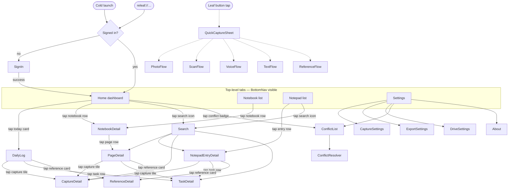
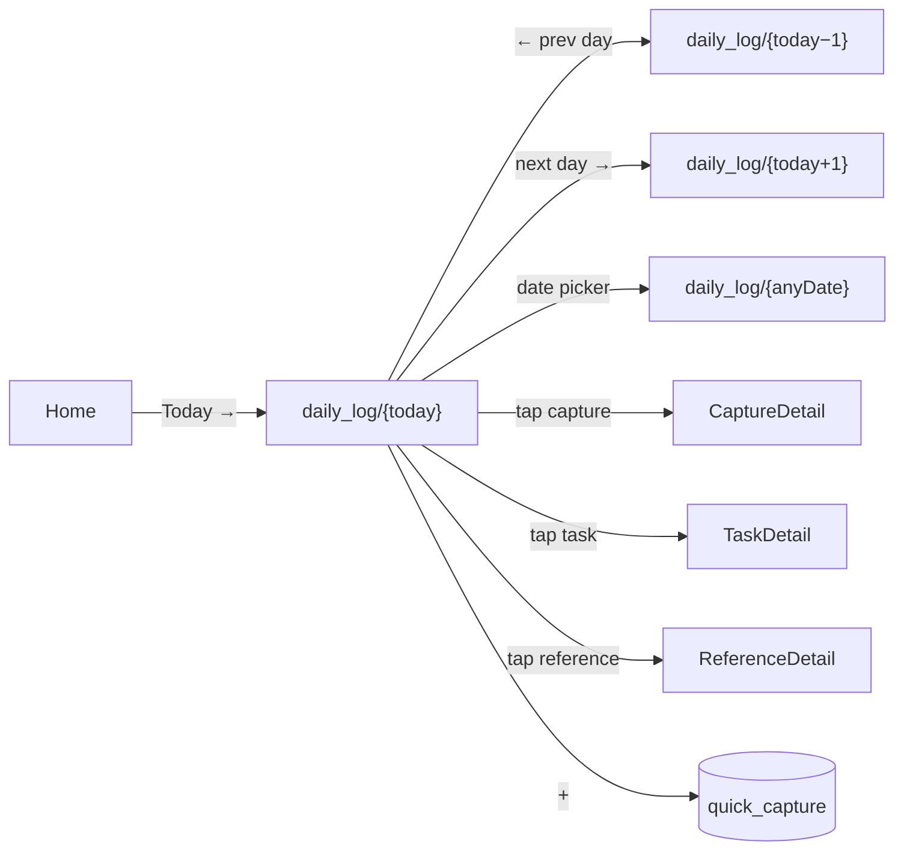
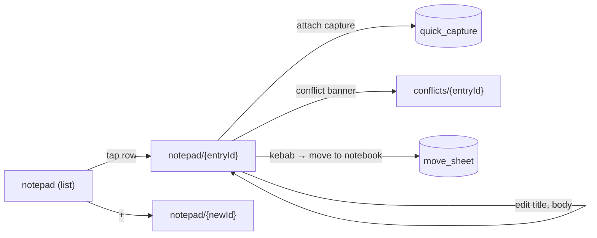
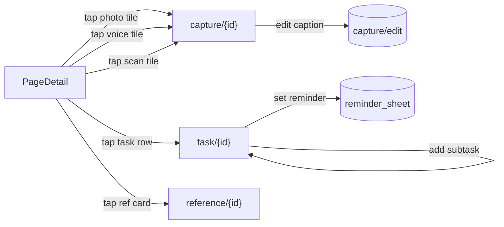
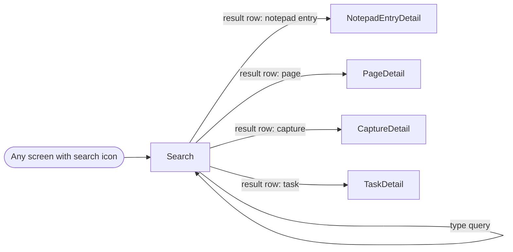
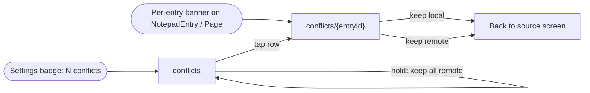
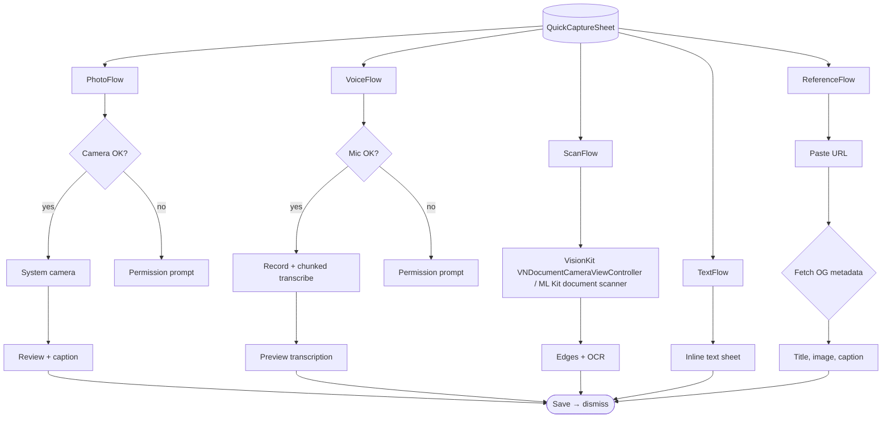

# Navigation graph — v2

Deliverable 2 from `PROMPT.md`. Describes every route, its entry points, and how `releaf://` URLs map onto them. Mirrors the routing patterns already in place: iOS uses per-tab `NavigationStack` with `NavigationPath`; Android uses a single `NavHost` with `popUpTo(HOME) { saveState = true }` for tab switches.

---

## Conventions

- **Tab-level**: one of the five `BottomNavItem.defaults` IDs — `home`, `notebook`, `leaf`, `notepad`, `settings`. BottomNav visible.
- **Drill-in**: pushes onto the current tab's stack. Hides BottomNav via `HideBottomBar` (iOS) / `Routes.topLevel` exclusion (Android).
- **Modal**: presented as sheet (iOS) or bottom-sheet / full-screen dialog (Android). Never pushes.
- **Overlay**: floating on top of any screen; banners, toasts, FAB hints. Not part of the back stack.

Node labels below follow `KebabCase` in mermaid to stay readable; real route constants use snake_case to match the existing `Routes` object.

---

## Top-level graph



Dashed edges are modal presentations. `Leaf` is not a destination — the center button opens `QuickCaptureSheet` without changing the selected tab.

---

## New-in-v2 destinations

Names below match the route constants each platform will add.

| Route id                   | Kind       | Hosted under tab | Notes                                         |
| -------------------------- | ---------- | ---------------- | --------------------------------------------- |
| `daily_log/{date}`         | Drill-in   | home             | `{date}` = ISO-8601 `YYYY-MM-DD`; today by default |
| `notepad/{entryId}`        | Drill-in   | notepad          | Rich-text editor for a `NotepadEntry`          |
| `capture/{captureId}`      | Drill-in   | any              | Opens within the current tab's stack           |
| `task/{taskId}`            | Drill-in   | any              | Editor + subtasks                              |
| `reference/{refId}`        | Drill-in   | any              | OG-metadata viewer, edit caption               |
| `search`                   | Drill-in   | any              | Global FTS5 search                             |
| `conflicts`                | Drill-in   | settings         | List of unresolved `conflict_stub` entries     |
| `conflicts/{entryId}`      | Drill-in   | settings         | Per-entry resolver from Q10                    |
| `settings/capture`         | Drill-in   | settings         | EXIF toggle, voice thresholds                  |
| `settings/export`          | Drill-in   | settings         | PDF sync toggle, bulk export                   |
| `settings/drive`           | Drill-in   | settings         | Account, storage, manual sync now              |
| `settings/about`           | Drill-in   | settings         | Version, OSS licenses                          |
| `quick_capture`            | Modal      | —                | Already exists; stays modal                    |
| `capture/{captureId}/edit` | Modal      | —                | Text capture edit / caption editor             |
| `conflict_banner`          | Overlay    | —                | Batch count badge on Settings tab              |

"Hosted under tab = any" means the destination lives in whichever tab was active when it opened — its back button returns to that tab's own previous screen. On iOS this falls out of per-tab `NavigationPath` naturally. On Android the current single-NavHost needs no change; `popBackStack()` handles it.

---

## Per-flow detail

### Home → Daily Log

Home is the dashboard (stats, recent activity, conflict badge). Tapping **Today** opens that day's log. The default `{date}` when entering via the Home card is `CURRENT_DATE` in the device's local timezone.



Prev/next day navigation **replaces** the current screen (iOS: pop+push with crossfade; Android: `popUpTo(daily_log) { inclusive = true }` + navigate) so the back stack stays shallow.

### Notepad list → Notepad editor



"+" generates a UUIDv7 client-side and pushes to the new route immediately — the row appears in the list on first save. This matches the "optimistic insert, dirty=1" pattern in the DDL.

### Page detail → Capture / Task / Reference detail



### Search

One global search. Tapping a result routes to the appropriate detail screen; the back button returns to the search results, not to the screen the user came from.



Backed by the four FTS5 virtual tables from `v1_initial.sql` — `fts_notepad_notes`, `fts_page_notes`, `fts_capture_text`, `fts_task_title`. Results grouped by kind with per-kind counts.

Entry points: Home header icon; Notepad list header icon; on iPad / landscape, a keyboard shortcut (⌘F) too. Not on the BottomNav — keeps the five-tab layout intact.

### Conflict resolution

Per `docs/OPEN_QUESTIONS.md` §10 and §12.



The resolver screen itself is a two-option sheet; after resolve, pop back to wherever the user came from (conflict list, or the entry screen that showed the per-entry banner).

### Capture flows (modal tree)



All capture flows land on the **source screen that opened `QuickCaptureSheet`**, not a new destination. The parent inference:

- If `QuickCaptureSheet` was opened with a current page/notepad-entry context → new capture's parent is set to that.
- If opened from Home / Daily Log / empty context → parent is today's `DailyLog` row (auto-created if not present).

This parent rule is encoded in the app layer, not the DDL — the CHECK constraint on `captures` only enforces *exactly one*, not *which one*.

---

## Deep-link dispatch — `releaf://`

```mermaid
graph TD
    URL([releaf://&lt;path&gt;]) --> Dispatch{Parse}
    Dispatch -- "notebook/:id"            --> OpenNotebook["navigate home → notebook/{id}"]
    Dispatch -- "notebook/:id/page/:pid"  --> OpenPage["navigate home → notebook/{id} → page/{pid}"]
    Dispatch -- "notepad"                 --> OpenNotepadTab["select notepad tab"]
    Dispatch -- "notepad/:id"             --> OpenNotepadEntry["select notepad → notepad/{id}"]
    Dispatch -- "capture/:id"             --> ResolveCapture{Query parent}
    ResolveCapture -- parent=page         --> OpenPageThenCapture["home → notebook/{nb} → page/{pg} → capture/{id}"]
    ResolveCapture -- parent=entry        --> OpenEntryThenCapture["notepad → notepad/{entry} → capture/{id}"]
    ResolveCapture -- parent=daily_log    --> OpenDailyThenCapture["home → daily_log/{date} → capture/{id}"]
    Dispatch -- "task/:id"                --> OpenTask[similar resolve-parent routing]
    Dispatch -- "today"                   --> OpenDaily["home → daily_log/{today}"]
    Dispatch -- "today/:date"             --> OpenDailyAny["home → daily_log/{date}"]
    Dispatch -- "search?q=..."            --> OpenSearch["home → search (prefilled)"]
    Dispatch -- "capture?kind=photo"      --> OpenQuickCapture["home → QuickCaptureSheet(kind)"]
    Dispatch -- "conflicts"               --> OpenConflicts["settings → conflicts"]
    Dispatch -- "settings/:subpage"       --> OpenSettingsSub["settings → settings/{subpage}"]
    Dispatch -- "restore"                 --> OpenRestoreFlow["settings → drive → restore"]
```



### Full URL table

| URL                                      | Lands on                                       | Back returns to          |
| ---------------------------------------- | ---------------------------------------------- | ------------------------ |
| `releaf://home`                          | Home                                           | —                        |
| `releaf://today`                         | `daily_log/{today}` under Home                 | Home                     |
| `releaf://today/2026-04-15`              | `daily_log/2026-04-15` under Home              | Home                     |
| `releaf://notebook/:id`                  | NotebookDetail under Home or Notebook tab      | Home / Notebook list     |
| `releaf://notebook/:id/page/:pid`        | PageDetail under the correct parent stack      | NotebookDetail           |
| `releaf://notepad`                       | Notepad list                                   | —                        |
| `releaf://notepad/:id`                   | NotepadEntryDetail under Notepad               | Notepad list             |
| `releaf://capture/:id`                   | CaptureDetail + rebuilt back stack per parent  | Parent's own screen      |
| `releaf://task/:id`                      | TaskDetail + rebuilt back stack per parent     | Parent's own screen      |
| `releaf://reference/:id`                 | ReferenceDetail + rebuilt back stack           | Parent's own screen      |
| `releaf://search?q=meadow`               | Search with `q` prefilled under Home           | Home                     |
| `releaf://capture?kind=photo`            | QuickCaptureSheet modal over current screen    | Current screen           |
| `releaf://conflicts`                     | Conflicts list under Settings                  | Settings                 |
| `releaf://conflicts/:entryId`            | Conflict resolver                              | Conflicts list           |
| `releaf://settings`                      | Settings                                       | —                        |
| `releaf://settings/capture`              | Capture settings                               | Settings                 |
| `releaf://settings/export`               | Export settings                                | Settings                 |
| `releaf://settings/drive`                | Drive settings                                 | Settings                 |
| `releaf://settings/drive/restore`        | Drive → restore flow                           | Drive settings           |

### Dispatch implementation notes

- **Signed-out state.** If the user taps a deep link while signed out, the target URL is stashed and the user routes through `SignIn`. On success, dispatch resumes to the stashed URL. If the URL requires a selection the user doesn't have access to (e.g. a capture from a different account), fall back to Home with a one-shot toast.
- **Deeply nested rebuilds.** `capture/:id` and `task/:id` need the parent chain loaded before navigating. On cold launch, that's a DB read on the splash screen; on warm launch, a background fetch that shows a transient spinner. Treat a missing parent (deleted, tombstoned) as a hard error with a toast and route to Home.
- **iOS Universal Links** are not in v2 scope; custom URL scheme only (`CFBundleURLSchemes: releaf`).
- **Android `<intent-filter>`** declares `android:scheme="releaf"` in the manifest with a single `LAUNCHER`-flagged activity that delegates to `Dispatch` before the NavHost.

---

## Notification & background entry points

Entry points **other than** cold launch, backgrounding, and deep links.

| Trigger                         | Lands on                                | Notes                                                  |
| ------------------------------- | --------------------------------------- | ------------------------------------------------------ |
| Task reminder fires             | `task/{id}`                             | Uses `reminders` + `tasks` tables; parent-chain rebuild |
| Drive sync conflict detected    | Conflict banner on affected screen     | If user not on that screen, subtle Settings badge      |
| Backup restore completed        | Home + toast "Restored N entries"       | Post-restore, route pops any open stack                |
| Share-sheet to Releaf           | QuickCaptureSheet with prefilled content | iOS: `Share Extension`; Android: `ACTION_SEND` intent   |
| Siri Shortcut / App Intent      | Per-intent routing (capture, today)     | v2 stretch; documented to-be-done                      |
| Widget tap                      | Per-widget routing (today, quick-cap)   | v2 stretch                                             |

---

## BottomNav visibility rules

BottomNav shows iff the currently-visible screen's route matches one of:

```
home | notebook | notepad | settings
```

Everything else is either a drill-in (hidden) or a modal (modal has no BottomNav by definition on either platform).

The current implementations already enforce this:

- **iOS** — `HideBottomBar` preference key set by each drill-in view; `MainShell` reads it and conditionally renders the BottomNav in `.safeAreaInset(edge: .bottom)`.
- **Android** — `Routes.topLevel` set gated by `currentRoute in Routes.topLevel` in the `Scaffold`'s `bottomBar` slot.

New drill-in routes need to opt in on iOS (`.hidesBottomBar()` modifier on the outermost `View`) and are excluded-by-default on Android (every route not in `Routes.topLevel` hides the bar).

---

## Open routing questions deferred to implementation

Items I chose to encode a specific answer for in this graph but that could reasonably flex during build:

1. **Daily Log as drill-in vs tab.** I'm treating `daily_log/{date}` as a drill-in under Home, not a sixth tab — the BottomNav already has five slots and adding one would destabilize the shell. If this feels wrong during the editor spike, the simplest alternative is a toggle inside Home header: **`Dashboard | Today`** segmented control that swaps the Home body, keeping Home as the stack owner.
2. **Search as drill-in vs tab.** Same reasoning: pulled in as a header-icon affordance rather than a tab. Accessible from Home and Notepad; a longer-term possibility is to surface it via `⌘F` on iPad and keyboard shortcuts.
3. **Capture detail's back-stack rebuild on deep link.** Chose to rebuild the parent chain so the user lands with a meaningful back button. Cheap alternative: land on CaptureDetail with no back stack and a "Home" back button; proposed because breadcrumbs matter more than one extra DB hit.
4. **New entry `{newId}` client-generated PK.** Consistent with the DDL — UUIDv7 generated client-side, not server-assigned. Means no "pending" state and no route rewrite on first save.

All four are revisable without touching the DDL. Flag in HANDOFF.md if you disagree.
